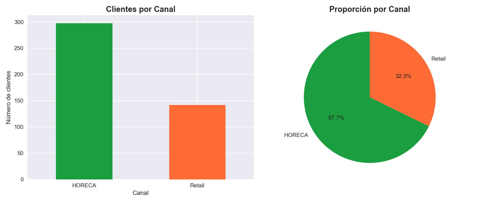
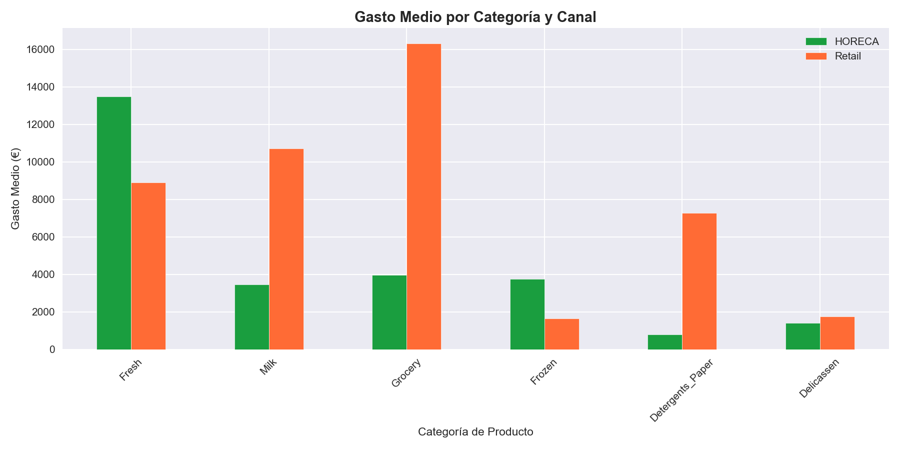
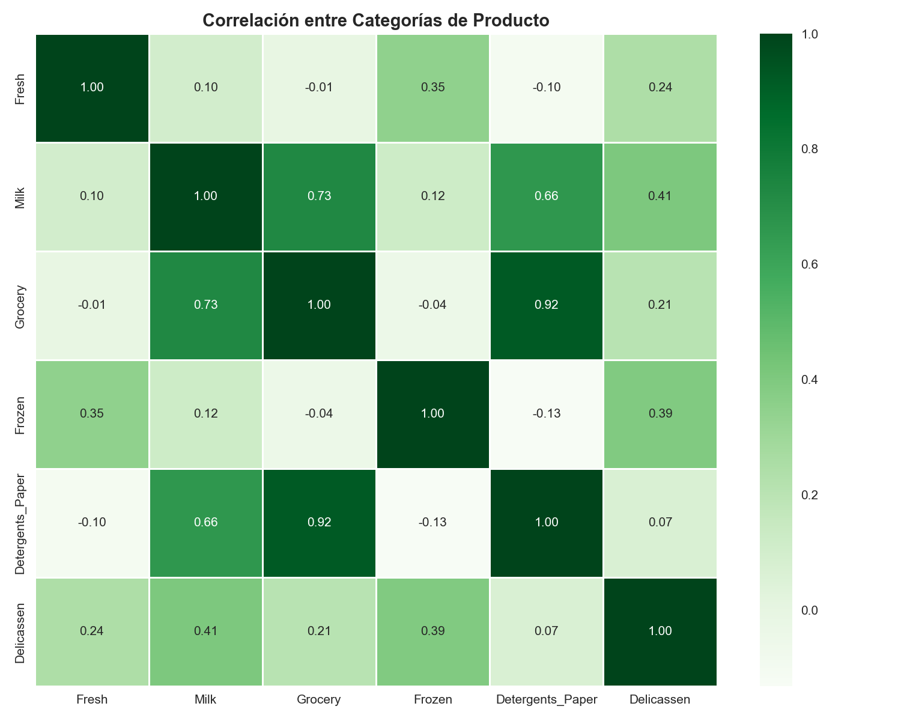
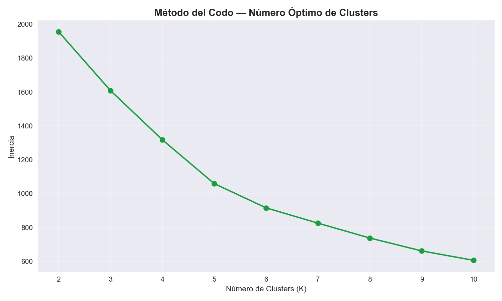
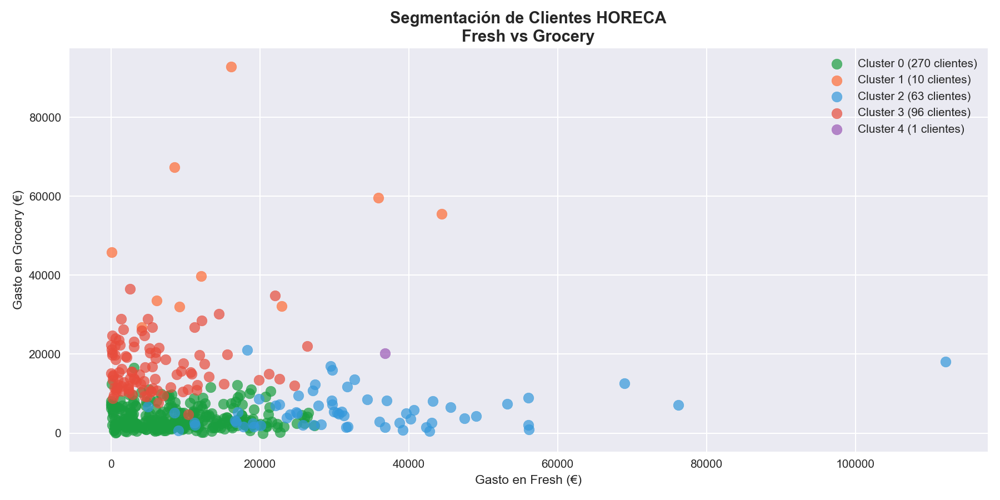
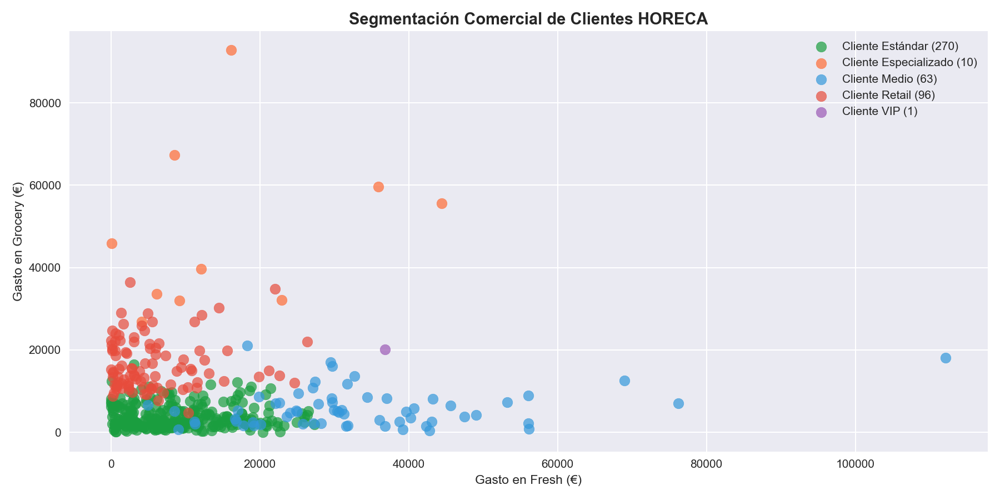

🇬🇧 English version | 🇪🇸 [Versión en español](README.md)

# 🍺 HORECA Customer Analysis — Python

## Overview
Customer segmentation analysis of a wholesale beverage distributor using clustering techniques with Python. Built as part of my data analytics portfolio targeting the HORECA sector and FMCG industry.

## Objective
Identify purchasing behavior patterns among HORECA and Retail customers, segment them into actionable commercial groups and extract insights for business decision-making.

## Dataset
- **Source:** Kaggle — Wholesale Customers Dataset
- **License:** UCI Machine Learning Repository
- **Size:** 440 customers × 8 columns
- **Categories:** Fresh, Milk, Grocery, Frozen, Detergents_Paper, Delicassen

## Tools & Technologies
- **Python** — analysis and modeling
- **Pandas & NumPy** — data manipulation
- **Matplotlib & Seaborn** — visualization
- **Scikit-learn** — K-Means clustering

## Analysis Process
- Dataset loading and exploration
- Quality check: 0 nulls, 0 duplicates
- Categorical variable transformation
- Exploratory analysis by channel
- Correlation heatmap between categories
- Normalization with StandardScaler
- Optimal K determination (elbow method)
- K-Means clustering with K=5
- Commercial naming of segments

## Key Insights
- 🍽️ HORECA represents 67.7% of customers
- 🛒 Retail outspends HORECA on average
- 🥩 HORECA dominates in Fresh and Frozen
- 🔗 High correlation between Grocery and Detergents_Paper (Retail profile)
- ⭐ Identified 1 VIP customer with extraordinary fresh product consumption

## Customer Segmentation
| Segment | Customers | Profile |
|---|---|---|
| Standard Customer | 270 | Moderate general consumption |
| Retail Customer | 96 | High Grocery spending |
| Mid-tier Customer | 63 | Balanced profile |
| Specialized Customer | 10 | Specific niche |
| VIP Customer | 1 | Extraordinary Fresh consumption |

## Visualizations

## Author
**Daniel Díaz De La Fuente**
Aspiring Data Analyst | Python · Power BI · SQL · R
Google Data Analytics Certificate (94.85% avg) · Business Analytics with Excel — Johns Hopkins
📍 Seville, Spain
[LinkedIn](https://www.linkedin.com/in/danieldiazdelafuente/) | [GitHub](https://github.com/DeLabFuente)

> 📥 Full notebook available in this repository: HORECA_Customer_Analysis.ipynb